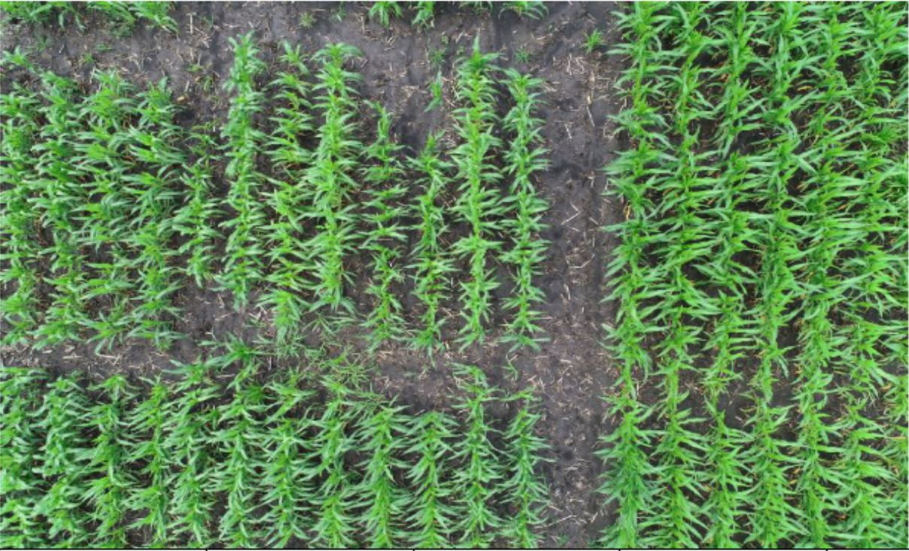
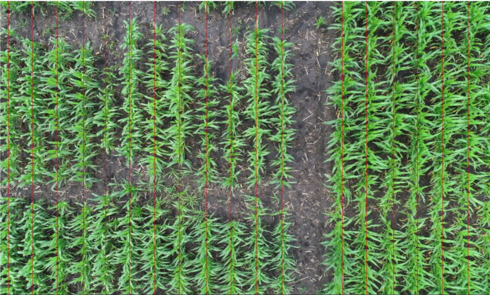

# crop.row.finder: a crop row detection package

## Introduction

crop.row.finder is a package developed to identify crop rows from a drone image. It uses techniques such as: **ExG** color transformation, **Otsu Transformation**, and **Morphology**.

## Workflow

A color image of crop rows is first transformed into a grayscale image using *ExG*[1], then made binary using the *Otsu Transformation*[2]. The binary image is then modified using morphology[3] to best isolate crop row centers and remove all unwanted noise (leaves, grass patches, weeds).

Once modified to an acceptable level, the image is rotated to find the degree of rotation that gives the most vertical crop rows. Crop rows need to be vertical so when taking the average of each column (value between [0,1]), high value columns can be identified as crop rows.

Ratios between local maxima and minima determine the 'goodness' of the crop row. large ratios = well defined crop rows, and the rotation with the most 'good ratios' is the best rotation for crop row identification of that image.

## Results

Demonstration of transformation on crop rows.

Before:

After:

[1] Woebbecke et al., 1995
    D.M. Woebbecke, G.E. Meyer, K. Von Bargen, D.A. Mortensen
    Color indices for weed identification under various soil, residue, and lighting conditions
    Transactions of the ASAE, 38 (1) (1995), pp. 259-269

[2] Otsu, 1975
    N. Otsu
    A threshold selection method from gray-level histograms
    Automatica, 11 (285–296) (1975), pp. 23-27

[3] https://en.wikipedia.org/wiki/Mathematical_morphology
